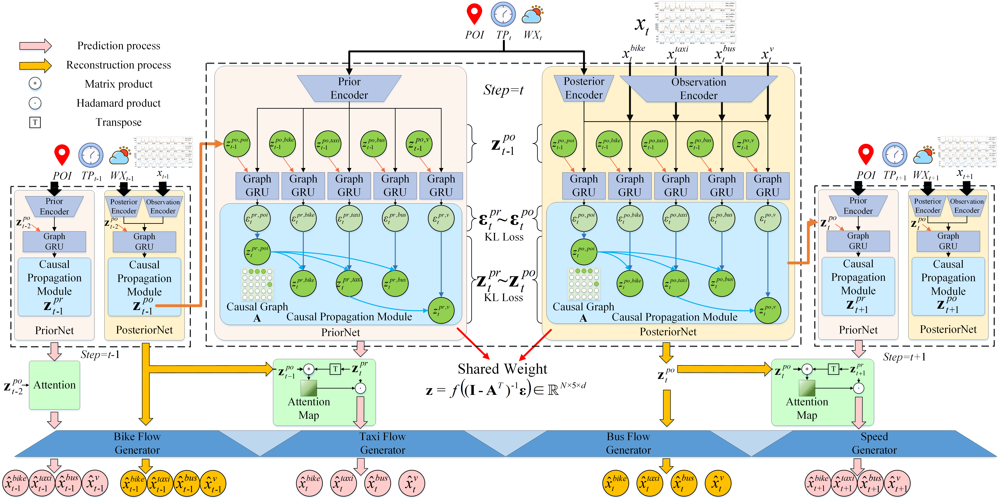

#  Causal Conditional Hidden Markov Model (CCHMM)
This is the official release code of AAAI2023 accepted paper: "Causal Conditional Hidden Markov Model for Multimodal Traffic Prediction"

The repository contains the necessary resources to run the experiments of the paper.

# Abstract
Multimodal traffic flow can reflect the health of the transportation system, and its prediction is crucial to urban traffic management.  

Recent works overemphasize spatio-temporal correlations of traffic flow, ignoring the physical concepts that lead to the generation of observations and their causal relationship.  

Spatio-temporal correlations are considered unstable under the influence of different conditions, and spurious correlations may exist in observations.  

In this paper, we analyze the physical concepts affecting the generation of multimode traffic flow from the perspective of the observation generation principle and propose a Causal Conditional Hidden Markov Model (CCHMM) to predict multimodal traffic flow.

We analyze the core physical concepts that affect the multimodal traffic flow generation process, disentangle the causal representations of concepts of interest, and further explore their causal relationship.


# How to run
It's very simple to run, just run the `main.py`

Change `test_only=True` in `config/config_1.yaml`

`data_name = 'BJ'` Test the Beijing multimodal transportation systems dataset

# Train

Change `test_only=False` in `config/config_1.yaml`

`data_name = 'BJ'` Train the Beijing multimodal transportation systems dataset


# Model



Thank you for your attention to our work. 

If you find this repository, e.g., the code and the datasets, useful in your research, please cite the following paper:

```
@inproceedings{Zhao2023CCHMM,
    title={Causal Conditional Hidden Markov Model for Multimodal Traffic Prediction},
    author={Zhao, Yu and Deng, Pan and Liu, Junting and Jia, Xiaofeng and Wang, Mulan},
    booktitle={Proceedings of the AAAI Conference on Artificial Intelligence},
    year={2023}
}
```